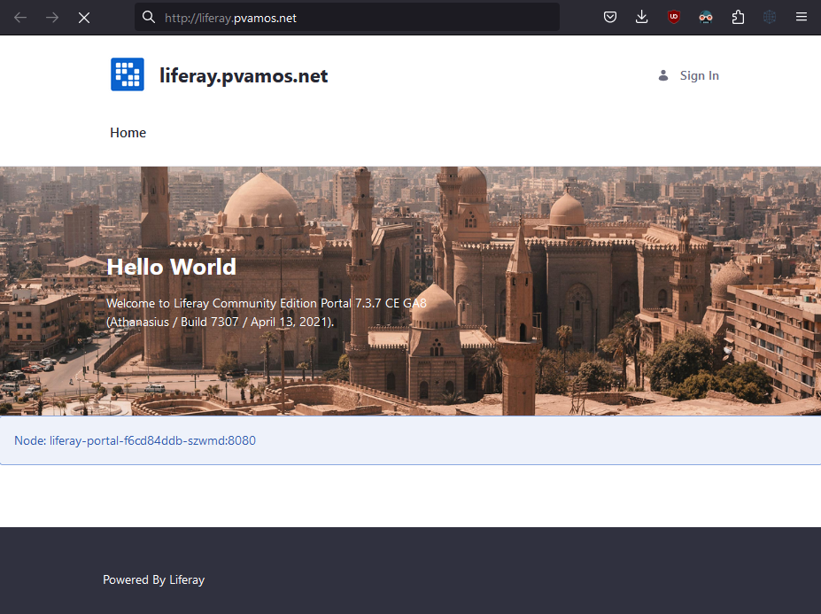
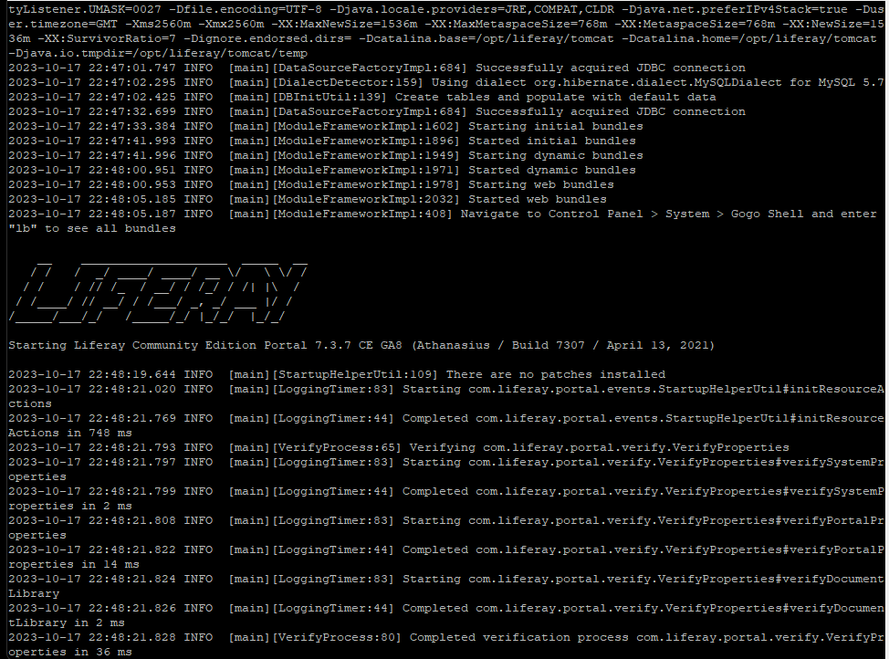

# liferay-k3s

<https://github.com/pvamos/liferay-k3s>


## Deploy Liferay Community Edition (CE) Portal to a K3s Kubernetes cluster runnig on Alpine linux


***Simple Kubernetes YAML Manifests and a bash script to deploy a Liferay CE Portal 7.3 Development environment to a K3s v1.27.5 custer running on Alpine Linux 3.18 nodes. Development environment with real Kubernetes to evaluate Liferay Portal features, in a very resource effectient way.***




## The goals

- The environment should be easily recreatable. It should be described in a declarative way
- Used architecture should be separated at least on the following tiers:
  - Application tier (Liferay Portal 7.4)
  - Database tier (MySQL)
  - Web server tier (Nginx)
- Liferay instance reachable on port 80
- ElasticSearch was not a goal


### Goal changes

I wanted to create a "real" Kubernetes deployment for Liferay and its dependencies.

I have very limited hardware resources available:
- 3 controlplane nodes with 1 vCPU and 2G RAM
- 3 worker nodes with 2 vCPU and 4G RAM

Without external Elasticsearch, the Liferay Portal shares the JVM with the embedded Elastic, this cannot fit to 4GB RAM.

By using an external Elasticsearch, the memory footprint Liferay Portal 7.3 is slightly less than 3G, so it fits using separate nodes *with some operational margin*. So I had to use the 7.3 version, configuring the external Elastic with the RESTful API (like in 7.4).

I also chose the K3s built in Traefik Ingress instead of Nginx as it needs much less resources. But I've also created a working Ninx configuration in `99-liferay-nginx.yaml`.

Most of the configurations are in `configMap`s and `secret`s created by `00-liferay-configs.yaml` and `01-create-configmaps.sh`.

The Liferay Portal injects the configuration from `configMap`s and `secret`s using an init container.

## Software versions used:
- Liferay CE Portal 7.3.7-ga8 <https://hub.docker.com/r/liferay/portal>
- Elasticsearch 7.17.13-5.2.0 <https://hub.docker.com/r/liferaycloud/elasticsearch>
- MySQL 5.7.43 <https://hub.docker.com/_/mysql>
- Nginx 1.25.2 <https://hub.docker.com/_/nginx>
- Klipper Service Load Balancer v0.4.4 <https://github.com/k3s-io/klipper-lb>
- Traefik reverse proxy and load balancer v2.9.10 <https://traefik.io/traefik/>
- Alpine Linux v3.18, GNU/Linux kernel 6.1.57-0-virt <https://www.alpinelinux.org/>
- k3s version v1.27.5+k3s1 <https://k3s.io/>
- Longhorn Storage v1.5.1 <https://longhorn.io>
- go version go1.20.10 <https://go.dev/>


## About the "infrastructure"


#### I've created a simple Ansible playbook to deploy a HA K3s Kubernetes cluster to the Alpine Linux nodes in a fully automated way.
#### I'm publishing the Ansible solution at <https://github.com/pvamos/alpine-k3s>

I've recorded a screen capture video of HA K3s deployment with Ansible:

[](https://www.youtube.com/watch?v=iAvKn8G8VqQ)

### Cluster nodes

I'm using <https://ovh.com> VPS-es for this project.

- 3 controlplane nodes
  -  1 vCore *(using '--ignore-preflight-errors=NumCPU')*
  -  2 GB memory
  -  40 GB SSD storage
- 3 worker nodes
  -  2 vCores
  -  4 GB memory
  -  80 GB SSD storage

### Loadbalancers

#### Traefik K3s Ingress

#### Klipper K3s Service Load Balancer

#### HAProxy

I use 2 small OVH VPS-es as a HA Active/Standby HAProxy setup in front of the 3 Kubernetes API servers running on the 3 controlplane nodes.

I also use them for the "published workloads" running on Kubernetes.

The 2 HAProxy hosts share 2 a floating IP-s with Keepalived.

-  one for the K8s API server

```sh
               HAProxy <-> API server
API client <-> HAProxy <-> API server
                (IP1)      API server
```

-  and one for the K8s workloads.

```sh
                       <-> Traefik <-> K                 K
                       <-> Traefik <-> l                 l
               HAProxy <-> Traefik <-> i <-> Liferay <-> i <-> MySQL
Web client <-> HAProxy <-> Traefik <-> p <->  Portal <-> p
                (IP2)  <-> Traefik <-> p                 p <-> ElasticSearch
                       <-> Traefik <-> e                 e
                                       r                 r
                      (1 on each node)
```

Both HAProxy hosts are configured similarly, forwarding requests to the API servers on the 3 controlplane nodes:

```sh
#/etc/haproxy/haproxy.cfg

defaults
    maxconn 20000
    mode    tcp
    option  dontlognull
    timeout http-request 10s
    timeout queue        1m
    timeout connect      10s
    timeout client       86400s
    timeout server       86400s
    timeout tunnel       86400s

frontend k8s-api
    bind 141.95.37.233:6443
    mode tcp
    default_backend k8s-api
backend k8s-api
    balance roundrobin
    mode tcp
    option tcp-check
    default-server inter 10s downinter 5s rise 2 fall 2 slowstart 60s maxconn 250 maxqueue 256 weight 100
    server control1 51.195.116.80:6443 check
    server control2 51.195.116.87:6443 check
    server control3 51.195.117.170:6443 check

frontend workload-80
    bind 54.37.90.48:80
    mode tcp
    default_backend workload-80
backend workload-80
    balance roundrobin
    mode tcp
    option tcp-check
    default-server inter 10s downinter 5s rise 2 fall 2 slowstart 60s maxconn 250 maxqueue 256 weight 100
    server worker1 51.195.116.254:80 check
    server worker2 51.195.118.45:80 check
    server worker3 51.195.119.241:80 check

frontend workload-443
    bind 54.37.90.48:443
    mode tcp
    default_backend workload-443
backend workload-443
    balance roundrobin
    mode tcp
    option tcp-check
    default-server inter 10s downinter 5s rise 2 fall 2 slowstart 60s maxconn 250 maxqueue 256 weight 100
    server worker1 51.195.116.254:443 check
    server worker2 51.195.118.45:443 check
    server worker3 51.195.119.241:443 check
```


## Starting state

Running K3s cluster, `kubectl` with the correct `kubeconfig` configured on workstation.

```sh
[p@ansible liferay-k3s]$ k get no -owide
NAME       STATUS   ROLES                       AGE    VERSION        INTERNAL-IP      EXTERNAL-IP      OS-IMAGE             KERNEL-VERSION   CONTAINER-RUNTIME
control1   Ready    control-plane,etcd,master   2d1h   v1.27.5-k3s1   51.195.116.80    51.195.116.80    Alpine Linux v3.18   6.1.57-0-virt    containerd://1.7.2
control2   Ready    control-plane,etcd,master   2d1h   v1.27.5-k3s1   51.195.116.87    51.195.116.87    Alpine Linux v3.18   6.1.57-0-virt    containerd://1.7.2
control3   Ready    control-plane,etcd,master   2d1h   v1.27.5-k3s1   51.195.117.170   51.195.117.170   Alpine Linux v3.18   6.1.57-0-virt    containerd://1.7.2
worker1    Ready    <none>                      2d1h   v1.27.5-k3s1   51.195.116.254   51.195.116.254   Alpine Linux v3.18   6.1.57-0-virt    containerd://1.7.2
worker2    Ready    <none>                      2d1h   v1.27.5-k3s1   51.195.118.45    51.195.118.45    Alpine Linux v3.18   6.1.57-0-virt    containerd://1.7.2
worker3    Ready    <none>                      2d1h   v1.27.5-k3s1   51.195.119.241   51.195.119.241   Alpine Linux v3.18   6.1.57-0-virt    containerd://1.7.2
```

```sh
[p@ansible liferay-k3s]$ k top no
NAME       CPU(cores)   CPU%   MEMORY(bytes)   MEMORY%
control1   100m         10%    1505Mi          77%
control2   68m          6%     1326Mi          68%
control3   60m          6%     1295Mi          66%
worker1    61m          3%     788Mi           20%
worker2    76m          3%     1413Mi          36%
worker3    69m          3%     941Mi           24%
```

## Deployment

The simple `deploy.sh` bash script deploys all the manifests in the right order.

```sh
#!/bin/bash

# deploy

kubectl create -f 00-liferay-configs.yaml

./01-create-configmaps.sh

kubectl create -f 02-liferay-mysql.yaml
kubectl create -f 03-liferay-search.yaml
kubectl create -f 04-liferay-portal.yaml
# kubectl create -f 99-liferay-nginx.yaml
kubectl create -f 05-liferay-ingress.yaml
```

01-create-configmaps.sh:
```sh
#!/bin/bash

# Storing config files in configMaps
#
# Liferay Portal configuration file:
#   portal-ext.properties
#
# Elasticsearch Connector OSGi configuration file:
#   com.liferay.portal.search.elasticsearch7.configuration.ElasticsearchConfiguration.config
#
# Nginx config file:
#   nginx.conf

kubectl create configmap -n liferay liferay-portal-config --from-file config-files/portal-ext.properties
kubectl create configmap -n liferay liferay-search-config --from-file config-files/com.liferay.portal.search.elasticsearch7.configuration.ElasticsearchConfiguration.config
kubectl create configmap -n liferay liferay-nginx-config --from-file config-files/nginx.conf

kubectl label configmap -n liferay liferay-portal-config app=liferay
kubectl label configmap -n liferay liferay-portal-config tier=portal
kubectl label configmap -n liferay liferay-search-config app=liferay
kubectl label configmap -n liferay liferay-search-config tier=search
kubectl label configmap -n liferay liferay-nginx-config app=liferay
kubectl label configmap -n liferay liferay-nginx-config tier=mysql
```

#### Script output
```sh
[p@ansible liferay-k3s]$ ./deploy.sh
namespace/liferay created
secret/liferay-db-creds created
secret/liferay-db-root created
configmap/liferay-portal-config created
configmap/liferay-search-config created
configmap/liferay-nginx-config created
configmap/liferay-portal-config labeled
configmap/liferay-portal-config labeled
configmap/liferay-search-config labeled
configmap/liferay-search-config labeled
configmap/liferay-nginx-config labeled
configmap/liferay-nginx-config labeled
service/liferay-mysql created
persistentvolumeclaim/liferay-mysql-pvc created
deployment.apps/liferay-mysql created
service/liferay-search created
persistentvolumeclaim/liferay-search-pvc created
deployment.apps/liferay-search created
service/liferay-portal created
persistentvolumeclaim/liferay-data created
persistentvolumeclaim/liferay-config created
deployment.apps/liferay-portal created
ingress.networking.k8s.io/liferay-ingress created
```

### The created objects

Kubernetes YAML Manifests (and a bash script to create configMaps from config files in `config-files` subdirectory):

 - 00-liferay-configs.yaml
   - namespace/liferay created
   - secret/liferay-db-creds created
   - secret/liferay-db-root created
 - 01-create-configmaps.sh
   - configmap/liferay-portal-config created
   - configmap/liferay-search-config created
   - configmap/liferay-nginx-config created
   - configmap/liferay-portal-config labeled
   - configmap/liferay-portal-config labeled
   - configmap/liferay-search-config labeled
   - configmap/liferay-search-config labeled
   - configmap/liferay-nginx-config labeled
   - configmap/liferay-nginx-config labeled
 - 02-liferay-mysql.yaml
   - service/liferay-mysql created
   - persistentvolumeclaim/liferay-mysql-pvc created
   - deployment.apps/liferay-mysql created
 - 03-liferay-search.yaml
   - service/liferay-search created
   - persistentvolumeclaim/liferay-search-pvc created
   - deployment.apps/liferay-search created
 - 04-liferay-portal.yaml
   - service/liferay-portal created
   - persistentvolumeclaim/liferay-data created
   - persistentvolumeclaim/liferay-config created
   - deployment.apps/liferay-portal created
 - 05-liferay-ingress.yaml
   - ingress.networking.k8s.io/liferay-ingress created
 - 99-liferay-nginx.yaml
   - service/liferay-nginx created
   - deployment.apps/liferay-nginx created





```sh
[p@ansible liferay-k3s]$ k top no
NAME       CPU(cores)   CPU%   MEMORY(bytes)   MEMORY%
control1   109m         10%    1491Mi          77%
control2   72m          7%     1323Mi          68%
control3   60m          6%     1295Mi          66%
worker1    90m          4%     3585Mi          93%
worker2    96m          4%     1566Mi          40%
worker3    209m         10%    3693Mi          96%
```

```sh
[p@ansible liferay-k3s]$ k top po -n liferay
NAME                              CPU(cores)   MEMORY(bytes)
liferay-mysql-64f7458689-rrjnr    2m           286Mi
liferay-nginx-75ff4cfccb-f4hw9    0m           2Mi
liferay-portal-f6cd84ddb-szwmd    15m          2828Mi
liferay-search-6d46bb947d-zft4v   3m           2412Mi
```

```sh
[p@ansible liferay-k3s]$ k get ingress -n liferay
NAME              CLASS     HOSTS                ADDRESS                                                                                  PORTS   AGE
liferay-ingress   traefik   liferay.pvamos.net   51.195.116.254,51.195.116.80,51.195.116.87,51.195.117.170,51.195.118.45,51.195.119.241   80      4m28s
```

```sh
[p@ansible liferay-k3s]$ k get svc -n liferay -owide
NAME             TYPE        CLUSTER-IP      EXTERNAL-IP   PORT(S)             AGE     SELECTOR
liferay-mysql    ClusterIP   10.43.26.156    <none>        3306/TCP            3h11m   app=liferay,tier=mysql
liferay-nginx    ClusterIP   10.43.150.207   <none>        8081/TCP            133m    app=liferay,tier=nginx
liferay-portal   ClusterIP   10.43.241.109   <none>        8080/TCP            3h      app=liferay,tier=portal
liferay-search   ClusterIP   10.43.78.223    <none>        9200/TCP,9300/TCP   3h11m   app=liferay,tier=search
[p@ansible liferay-k3s]$ k get po -n liferay -owide --show-labels
```

```sh
NAME                              READY   STATUS    RESTARTS   AGE     IP            NODE      NOMINATED NODE   READINESS GATES   LABELS
liferay-mysql-64f7458689-rrjnr    1/1     Running   0          3h12m   10.42.4.126   worker1   <none>           <none>            app=liferay,pod-template-hash=64f7458689,tier=mysql
liferay-nginx-75ff4cfccb-f4hw9    1/1     Running   0          133m    10.42.3.69    worker2   <none>           <none>            app=liferay,pod-template-hash=75ff4cfccb,tier=nginx
liferay-portal-f6cd84ddb-szwmd    1/1     Running   0          3h1m    10.42.5.64    worker3   <none>           <none>            app=liferay,pod-template-hash=f6cd84ddb,tier=portal
liferay-search-6d46bb947d-zft4v   1/1     Running   0          3h12m   10.42.4.127   worker1   <none>           <none>            app=liferay,pod-template-hash=6d46bb947d,tier=search

```

### See full Liferay CE Portal startup log at the end of this `README.md`


## Tear down

The simple `tear-down.sh` bash script deletes all the created K8s objects in the right order.

```sh
#!/bin/bash

# tear down

kubectl delete -f 05-liferay-ingress.yaml
# kubectl delete -f 99-liferay-nginx.yaml
kubectl delete -f 04-liferay-portal.yaml
kubectl delete -f 03-liferay-search.yaml
kubectl delete -f 02-liferay-mysql.yaml

kubectl delete configmap -n liferay liferay-portal-config
kubectl delete configmap -n liferay liferay-search-config
kubectl delete configmap -n liferay liferay-nginx-config

kubectl delete -f 00-liferay-configs.yaml
```

```sh
[p@ansible liferay-k3s]$ ./tear-down.sh
ingress.networking.k8s.io "liferay-ingress" deleted
service "liferay-portal" deleted
persistentvolumeclaim "liferay-data" deleted
persistentvolumeclaim "liferay-config" deleted
deployment.apps "liferay-portal" deleted
service "liferay-search" deleted
persistentvolumeclaim "liferay-search-pvc" deleted
deployment.apps "liferay-search" deleted
service "liferay-mysql" deleted
persistentvolumeclaim "liferay-mysql-pvc" deleted
deployment.apps "liferay-mysql" deleted
configmap "liferay-portal-config" deleted
configmap "liferay-search-config" deleted
configmap "liferay-nginx-config" deleted
namespace "liferay" deleted
secret "liferay-db-creds" deleted
secret "liferay-db-root" deleted
```

### Full Liferay CE Portal startup log

```sh
[p@ansible liferay-k3s]$ k logs -f -n liferay liferay-portal-f6cd84ddb-szwmd liferay
[LIFERAY] To SSH into this container, run: "docker exec -it liferay-portal-f6cd84ddb-szwmd /bin/bash".

[LIFERAY] Using zulu8 JDK. You can use another JDK by setting the "JAVA_VERSION" environment variable.
[LIFERAY] Available JDKs: zulu11, zulu8.
[LIFERAY] Copying files from /mnt/liferay/files:

/mnt/liferay/files
├── osgi
│   └── configs
│       └── com.liferay.portal.search.elasticsearch7.configuration.ElasticsearchConfiguration.config
└── portal-ext.properties

[LIFERAY] ... into /opt/liferay.

[LIFERAY] The directory /mnt/liferay/scripts does not exist. Create the directory $(pwd)/xyz123/scripts on the host operating system to create the directory /mnt/liferay/scripts on the container. Files in /mnt/liferay/scripts will be executed, in alphabetical order, before Liferay Portal starts.

[LIFERAY] The directory /mnt/liferay/deploy does not exist. Create the directory $(pwd)/xyz123/deploy on the host operating system to create the directory /mnt/liferay/deploy on the container. Copy files to $(pwd)/xyz123/deploy to deploy modules to Liferay Portal at runtime.

[LIFERAY] Starting Liferay Portal. To stop the container with CTRL-C, run this container with the option "-it".

17-Oct-2023 22:46:40.026 INFO [main] org.apache.catalina.startup.Catalina.load Server initialization in [1109] milliseconds
Loading jar:file:/opt/liferay/tomcat/webapps/ROOT/WEB-INF/lib/portal-impl.jar!/system.properties
Loading jar:file:/opt/liferay/tomcat/webapps/ROOT/WEB-INF/lib/portal-impl.jar!/portal.properties
Loading file:/opt/liferay/portal-ext.properties
2023-10-17 22:46:42.665 INFO  [main][PortalContextLoaderListener:139] JVM arguments: -Djava.util.logging.config.file=/opt/liferay/tomcat/conf/logging.properties -Djava.util.logging.manager=org.apache.juli.ClassLoaderLogManager -Djdk.tls.ephemeralDHKeySize=2048 -Djava.protocol.handler.pkgs=org.apache.catalina.webresources -Dorg.apache.catalina.security.SecurityListener.UMASK=0027 -Dfile.encoding=UTF-8 -Djava.locale.providers=JRE,COMPAT,CLDR -Djava.net.preferIPv4Stack=true -Duser.timezone=GMT -Xms2560m -Xmx2560m -XX:MaxNewSize=1536m -XX:MaxMetaspaceSize=768m -XX:MetaspaceSize=768m -XX:NewSize=1536m -XX:SurvivorRatio=7 -Dignore.endorsed.dirs= -Dcatalina.base=/opt/liferay/tomcat -Dcatalina.home=/opt/liferay/tomcat -Djava.io.tmpdir=/opt/liferay/tomcat/temp
2023-10-17 22:47:01.747 INFO  [main][DataSourceFactoryImpl:684] Successfully acquired JDBC connection
2023-10-17 22:47:02.295 INFO  [main][DialectDetector:159] Using dialect org.hibernate.dialect.MySQLDialect for MySQL 5.7
2023-10-17 22:47:02.425 INFO  [main][DBInitUtil:139] Create tables and populate with default data
2023-10-17 22:47:32.699 INFO  [main][DataSourceFactoryImpl:684] Successfully acquired JDBC connection
2023-10-17 22:47:33.384 INFO  [main][ModuleFrameworkImpl:1602] Starting initial bundles
2023-10-17 22:47:41.993 INFO  [main][ModuleFrameworkImpl:1896] Started initial bundles
2023-10-17 22:47:41.996 INFO  [main][ModuleFrameworkImpl:1949] Starting dynamic bundles
2023-10-17 22:48:00.951 INFO  [main][ModuleFrameworkImpl:1971] Started dynamic bundles
2023-10-17 22:48:00.953 INFO  [main][ModuleFrameworkImpl:1978] Starting web bundles
2023-10-17 22:48:05.185 INFO  [main][ModuleFrameworkImpl:2032] Started web bundles
2023-10-17 22:48:05.187 INFO  [main][ModuleFrameworkImpl:408] Navigate to Control Panel > System > Gogo Shell and enter "lb" to see all bundles

    __    ____________________  _____  __
   / /   /  _/ ____/ ____/ __ \/   \ \/ /
  / /    / // /_  / __/ / /_/ / /| |\  /
 / /____/ // __/ / /___/ _, _/ ___ |/ /
/_____/___/_/   /_____/_/ |_/_/  |_/_/

Starting Liferay Community Edition Portal 7.3.7 CE GA8 (Athanasius / Build 7307 / April 13, 2021)

2023-10-17 22:48:19.644 INFO  [main][StartupHelperUtil:109] There are no patches installed
2023-10-17 22:48:21.020 INFO  [main][LoggingTimer:83] Starting com.liferay.portal.events.StartupHelperUtil#initResourceActions
2023-10-17 22:48:21.769 INFO  [main][LoggingTimer:44] Completed com.liferay.portal.events.StartupHelperUtil#initResourceActions in 748 ms
2023-10-17 22:48:21.793 INFO  [main][VerifyProcess:65] Verifying com.liferay.portal.verify.VerifyProperties
2023-10-17 22:48:21.797 INFO  [main][LoggingTimer:83] Starting com.liferay.portal.verify.VerifyProperties#verifySystemProperties
2023-10-17 22:48:21.799 INFO  [main][LoggingTimer:44] Completed com.liferay.portal.verify.VerifyProperties#verifySystemProperties in 2 ms
2023-10-17 22:48:21.808 INFO  [main][LoggingTimer:83] Starting com.liferay.portal.verify.VerifyProperties#verifyPortalProperties
2023-10-17 22:48:21.822 INFO  [main][LoggingTimer:44] Completed com.liferay.portal.verify.VerifyProperties#verifyPortalProperties in 14 ms
2023-10-17 22:48:21.824 INFO  [main][LoggingTimer:83] Starting com.liferay.portal.verify.VerifyProperties#verifyDocumentLibrary
2023-10-17 22:48:21.826 INFO  [main][LoggingTimer:44] Completed com.liferay.portal.verify.VerifyProperties#verifyDocumentLibrary in 2 ms
2023-10-17 22:48:21.828 INFO  [main][VerifyProcess:80] Completed verification process com.liferay.portal.verify.VerifyProperties in 36 ms
2023-10-17 22:48:21.831 INFO  [main][VerifyProcess:65] Verifying com.liferay.portal.verify.VerifyGroup
2023-10-17 22:48:21.833 INFO  [main][LoggingTimer:83] Starting com.liferay.portal.verify.VerifyGroup#verifyStagedGroups
2023-10-17 22:48:21.951 INFO  [main][LoggingTimer:44] Completed com.liferay.portal.verify.VerifyGroup#verifyStagedGroups in 118 ms
2023-10-17 22:48:21.951 INFO  [main][VerifyProcess:80] Completed verification process com.liferay.portal.verify.VerifyGroup in 120 ms
2023-10-17 22:48:21.956 INFO  [main][VerifyProcess:65] Verifying com.liferay.portal.verify.VerifyResourcePermissions
2023-10-17 22:48:21.966 INFO  [main][VerifyProcess:80] Completed verification process com.liferay.portal.verify.VerifyResourcePermissions in 10 ms
2023-10-17 22:48:23.080 INFO  [main][AutoDeployDir:206] Auto deploy scanner started for /opt/liferay/deploy
2023-10-17 22:48:26.253 WARN  [liferay/mail-3][MailMessageListener:135] Email test@domain.invalid will be ignored because it is included in mail.send.blacklist
2023-10-17 22:48:26.304 WARN  [liferay/mail-3][MailMessageListener:52] Skipping email because the sender is not specified
2023-10-17 22:48:38.921 INFO  [com.liferay.portal.osgi.web.wab.extender.internal.WabFactory-BundleTrackerOpener][ThemeHotDeployListener:108] 1 theme for speedwell-theme is available for use
2023-10-17 22:48:39.335 INFO  [com.liferay.portal.osgi.web.wab.extender.internal.WabFactory-BundleTrackerOpener][ThemeHotDeployListener:108] 1 theme for admin-theme is available for use
2023-10-17 22:48:39.600 INFO  [com.liferay.portal.osgi.web.wab.extender.internal.WabFactory-BundleTrackerOpener][ThemeHotDeployListener:108] 1 theme for classic-theme is available for use
2023-10-17 22:48:39.797 INFO  [com.liferay.portal.osgi.web.wab.extender.internal.WabFactory-BundleTrackerOpener][ThemeHotDeployListener:108] 1 theme for minium-theme is available for use
2023-10-17 22:49:42.236 INFO  [main][UpgradeProcess:101] Upgrading com.liferay.message.boards.layout.set.prototype.internal.upgrade.v1_0_0.UpgradeLocalizedColumn
2023-10-17 22:49:42.288 INFO  [main][UpgradeProcess:115] Completed upgrade process com.liferay.message.boards.layout.set.prototype.internal.upgrade.v1_0_0.UpgradeLocalizedColumn in 53 ms
2023-10-17 22:49:42.556 INFO  [main][UpgradeProcess:101] Upgrading com.liferay.license.manager.web.internal.upgrade.v1_0_1.UpgradePortletId
2023-10-17 22:49:42.562 INFO  [main][UpgradeProcess:115] Completed upgrade process com.liferay.license.manager.web.internal.upgrade.v1_0_1.UpgradePortletId in 6 ms
2023-10-17 22:49:42.709 INFO  [main][UpgradeProcess:101] Upgrading com.liferay.wiki.layout.prototype.internal.upgrade.v1_0_0.UpgradeLocalizedColumn
2023-10-17 22:49:42.729 INFO  [main][UpgradeProcess:115] Completed upgrade process com.liferay.wiki.layout.prototype.internal.upgrade.v1_0_0.UpgradeLocalizedColumn in 20 ms
2023-10-17 22:49:43.016 INFO  [main][UpgradeProcess:101] Upgrading com.liferay.asset.publisher.layout.prototype.internal.upgrade.v1_0_0.UpgradeLocalizedColumn
2023-10-17 22:49:43.032 INFO  [main][UpgradeProcess:115] Completed upgrade process com.liferay.asset.publisher.layout.prototype.internal.upgrade.v1_0_0.UpgradeLocalizedColumn in 16 ms
2023-10-17 22:49:43.467 INFO  [main][UpgradeProcess:101] Upgrading com.liferay.blogs.layout.prototype.internal.upgrade.v1_0_0.UpgradeLocalizedColumn
2023-10-17 22:49:43.510 INFO  [main][UpgradeProcess:115] Completed upgrade process com.liferay.blogs.layout.prototype.internal.upgrade.v1_0_0.UpgradeLocalizedColumn in 44 ms
2023-10-17 22:49:43.598 INFO  [main][UpgradeProcess:101] Upgrading com.liferay.organizations.internal.upgrade.v1_0_0.UpgradeOrganizationTypesConfiguration
2023-10-17 22:49:43.599 INFO  [main][UpgradeProcess:115] Completed upgrade process com.liferay.organizations.internal.upgrade.v1_0_0.UpgradeOrganizationTypesConfiguration in 1 ms
2023-10-17 22:49:43.828 INFO  [main][UpgradeProcess:101] Upgrading com.liferay.document.library.layout.set.prototype.internal.upgrade.v1_0_0.UpgradeLocalizedColumn
2023-10-17 22:49:43.843 INFO  [main][UpgradeProcess:115] Completed upgrade process com.liferay.document.library.layout.set.prototype.internal.upgrade.v1_0_0.UpgradeLocalizedColumn in 15 ms
2023-10-17 22:49:46.866 INFO  [main][UpgradeProcess:101] Upgrading com.liferay.portal.security.sso.token.internal.upgrade.v2_0_0.UpgradeTokenConfiguration
2023-10-17 22:49:46.882 INFO  [main][UpgradeProcess:115] Completed upgrade process com.liferay.portal.security.sso.token.internal.upgrade.v2_0_0.UpgradeTokenConfiguration in 16 ms
2023-10-17 22:49:47.443 INFO  [main][UpgradeProcess:101] Upgrading com.liferay.site.navigation.menu.web.internal.upgrade.v1_0_1.RenameUpgradePortletPreferences
2023-10-17 22:49:47.444 INFO  [main][LoggingTimer:83] Starting com.liferay.site.navigation.menu.web.internal.upgrade.v1_0_1.RenameUpgradePortletPreferences#updatePortletPreferences
2023-10-17 22:49:47.446 INFO  [main][LoggingTimer:83] Starting com.liferay.portal.kernel.upgrade.v6_2_0.BaseUpgradePortletPreferences#updatePortletPreferencesWithOwnerType
2023-10-17 22:49:47.475 INFO  [main][LoggingTimer:44] Completed com.liferay.portal.kernel.upgrade.v6_2_0.BaseUpgradePortletPreferences#updatePortletPreferencesWithOwnerType in 29 ms
2023-10-17 22:49:47.477 INFO  [main][LoggingTimer:83] Starting com.liferay.portal.kernel.upgrade.v6_2_0.BaseUpgradePortletPreferences#updatePortletPreferencesWithOwnerType
2023-10-17 22:49:47.479 INFO  [main][LoggingTimer:44] Completed com.liferay.portal.kernel.upgrade.v6_2_0.BaseUpgradePortletPreferences#updatePortletPreferencesWithOwnerType in 2 ms
2023-10-17 22:49:47.480 INFO  [main][LoggingTimer:83] Starting com.liferay.portal.kernel.upgrade.v6_2_0.BaseUpgradePortletPreferences#updatePortletPreferencesWithOwnerType
2023-10-17 22:49:47.485 INFO  [main][LoggingTimer:44] Completed com.liferay.portal.kernel.upgrade.v6_2_0.BaseUpgradePortletPreferences#updatePortletPreferencesWithOwnerType in 5 ms
2023-10-17 22:49:47.487 INFO  [main][LoggingTimer:83] Starting com.liferay.portal.kernel.upgrade.v6_2_0.BaseUpgradePortletPreferences#updatePortletPreferencesWithOwnerType
2023-10-17 22:49:47.489 INFO  [main][LoggingTimer:44] Completed com.liferay.portal.kernel.upgrade.v6_2_0.BaseUpgradePortletPreferences#updatePortletPreferencesWithOwnerType in 2 ms
2023-10-17 22:49:47.491 INFO  [main][LoggingTimer:83] Starting com.liferay.portal.kernel.upgrade.v6_2_0.BaseUpgradePortletPreferences#updatePortletPreferencesWithOwnerType
2023-10-17 22:49:47.494 INFO  [main][LoggingTimer:44] Completed com.liferay.portal.kernel.upgrade.v6_2_0.BaseUpgradePortletPreferences#updatePortletPreferencesWithOwnerType in 3 ms
2023-10-17 22:49:47.496 INFO  [main][LoggingTimer:83] Starting com.liferay.portal.kernel.upgrade.v6_2_0.BaseUpgradePortletPreferences#updatePortletPreferencesWithOwnerType
2023-10-17 22:49:47.498 INFO  [main][LoggingTimer:44] Completed com.liferay.portal.kernel.upgrade.v6_2_0.BaseUpgradePortletPreferences#updatePortletPreferencesWithOwnerType in 2 ms
2023-10-17 22:49:47.500 INFO  [main][LoggingTimer:83] Starting com.liferay.portal.kernel.upgrade.v6_2_0.BaseUpgradePortletPreferences#updatePortletPreferencesWithOwnerType
2023-10-17 22:49:47.505 INFO  [main][LoggingTimer:44] Completed com.liferay.portal.kernel.upgrade.v6_2_0.BaseUpgradePortletPreferences#updatePortletPreferencesWithOwnerType in 5 ms
2023-10-17 22:49:47.506 INFO  [main][LoggingTimer:44] Completed com.liferay.site.navigation.menu.web.internal.upgrade.v1_0_1.RenameUpgradePortletPreferences#updatePortletPreferences in 62 ms
2023-10-17 22:49:47.508 INFO  [main][UpgradeProcess:115] Completed upgrade process com.liferay.site.navigation.menu.web.internal.upgrade.v1_0_1.RenameUpgradePortletPreferences in 66 ms
2023-10-17 22:49:47.942 INFO  [main][UpgradeProcess:101] Upgrading com.liferay.portal.settings.web.internal.upgrade.v1_0_1.UpgradeInstanceSettingsPortletId
2023-10-17 22:49:47.945 INFO  [main][LoggingTimer:83] Starting com.liferay.portal.kernel.upgrade.BaseUpgradePortletId#upgradeInstanceablePortletIds
2023-10-17 22:49:47.966 INFO  [main][LoggingTimer:44] Completed com.liferay.portal.kernel.upgrade.BaseUpgradePortletId#upgradeInstanceablePortletIds in 21 ms
2023-10-17 22:49:47.968 INFO  [main][LoggingTimer:83] Starting com.liferay.portal.kernel.upgrade.BaseUpgradePortletId#upgradeUninstanceablePortletIds
2023-10-17 22:49:47.969 INFO  [main][LoggingTimer:44] Completed com.liferay.portal.kernel.upgrade.BaseUpgradePortletId#upgradeUninstanceablePortletIds in 1 ms
2023-10-17 22:49:47.970 INFO  [main][UpgradeProcess:115] Completed upgrade process com.liferay.portal.settings.web.internal.upgrade.v1_0_1.UpgradeInstanceSettingsPortletId in 28 ms
2023-10-17 22:49:47.987 INFO  [main][UpgradeProcess:101] Upgrading com.liferay.portal.settings.web.internal.upgrade.v1_0_2.UpgradeResourceAction
2023-10-17 22:49:47.989 INFO  [main][UpgradeProcess:115] Completed upgrade process com.liferay.portal.settings.web.internal.upgrade.v1_0_2.UpgradeResourceAction in 2 ms
2023-10-17 22:49:48.563 INFO  [Portal Dependency Manager Component Executor--1][UpgradeProcess:101] Upgrading com.liferay.segments.content.targeting.upgrade.internal.v1_0_0.UpgradeContentTargeting
2023-10-17 22:49:48.570 INFO  [Portal Dependency Manager Component Executor--1][UpgradeProcess:115] Completed upgrade process com.liferay.segments.content.targeting.upgrade.internal.v1_0_0.UpgradeContentTargeting in 7 ms
2023-10-17 22:49:50.300 INFO  [main][UpgradeProcess:101] Upgrading com.liferay.contacts.web.internal.upgrade.v1_0_0.UpgradePortletId
2023-10-17 22:49:50.301 INFO  [main][LoggingTimer:83] Starting com.liferay.portal.kernel.upgrade.BaseUpgradePortletId#upgradeInstanceablePortletIds
2023-10-17 22:49:50.378 INFO  [main][LoggingTimer:44] Completed com.liferay.portal.kernel.upgrade.BaseUpgradePortletId#upgradeInstanceablePortletIds in 77 ms
2023-10-17 22:49:50.381 INFO  [main][LoggingTimer:83] Starting com.liferay.portal.kernel.upgrade.BaseUpgradePortletId#upgradeUninstanceablePortletIds
2023-10-17 22:49:50.383 INFO  [main][LoggingTimer:44] Completed com.liferay.portal.kernel.upgrade.BaseUpgradePortletId#upgradeUninstanceablePortletIds in 2 ms
2023-10-17 22:49:50.387 INFO  [main][UpgradeProcess:115] Completed upgrade process com.liferay.contacts.web.internal.upgrade.v1_0_0.UpgradePortletId in 87 ms
2023-10-17 22:49:50.504 INFO  [main][UpgradeProcess:101] Upgrading com.liferay.portal.search.web.internal.upgrade.v2_0_0.UpgradeSearchPortlet
2023-10-17 22:49:50.507 INFO  [main][UpgradeProcess:115] Completed upgrade process com.liferay.portal.search.web.internal.upgrade.v2_0_0.UpgradeSearchPortlet in 3 ms
2023-10-17 22:49:50.607 INFO  [main][UpgradeProcess:101] Upgrading com.liferay.document.library.document.conversion.internal.upgrade.v1_0_0.UpgradeOpenOfficeConfiguration
2023-10-17 22:49:50.609 INFO  [main][UpgradeProcess:115] Completed upgrade process com.liferay.document.library.document.conversion.internal.upgrade.v1_0_0.UpgradeOpenOfficeConfiguration in 2 ms
2023-10-17 22:49:50.688 INFO  [main][UpgradeProcess:101] Upgrading com.liferay.captcha.internal.upgrade.v1_0_0.UpgradeCaptchaConfiguration
2023-10-17 22:49:50.691 INFO  [main][UpgradeProcess:115] Completed upgrade process com.liferay.captcha.internal.upgrade.v1_0_0.UpgradeCaptchaConfiguration in 3 ms
2023-10-17 22:49:50.725 INFO  [main][UpgradeProcess:101] Upgrading com.liferay.captcha.internal.upgrade.v1_1_0.UpgradeCaptchaConfigurationPreferences
2023-10-17 22:49:50.738 INFO  [main][UpgradeProcess:115] Completed upgrade process com.liferay.captcha.internal.upgrade.v1_1_0.UpgradeCaptchaConfigurationPreferences in 13 ms
2023-10-17 22:49:51.016 INFO  [main][UpgradeProcess:101] Upgrading com.liferay.portal.upload.internal.upgrade.v1_0_0.UpgradeUploadServletRequestConfiguration
2023-10-17 22:49:51.018 INFO  [main][UpgradeProcess:115] Completed upgrade process com.liferay.portal.upload.internal.upgrade.v1_0_0.UpgradeUploadServletRequestConfiguration in 2 ms
2023-10-17 22:49:51.113 INFO  [main][UpgradeProcess:101] Upgrading com.liferay.analytics.settings.web.internal.upgrade.v1_0_0.UpgradeAnalyticsConfigurationPreferences
2023-10-17 22:49:51.116 INFO  [main][UpgradeProcess:115] Completed upgrade process com.liferay.analytics.settings.web.internal.upgrade.v1_0_0.UpgradeAnalyticsConfigurationPreferences in 3 ms
2023-10-17 22:49:51.133 INFO  [main][UpgradeProcess:101] Upgrading com.liferay.analytics.settings.web.internal.upgrade.v1_0_1.UpgradeAnalyticsConfigurationPreferences
2023-10-17 22:49:51.135 INFO  [main][UpgradeProcess:115] Completed upgrade process com.liferay.analytics.settings.web.internal.upgrade.v1_0_1.UpgradeAnalyticsConfigurationPreferences in 2 ms
2023-10-17 22:49:51.384 INFO  [main][UpgradeProcess:101] Upgrading com.liferay.portal.kernel.upgrade.BaseUpgradeStagingGroupTypeSettings
2023-10-17 22:49:51.397 INFO  [main][UpgradeProcess:115] Completed upgrade process com.liferay.portal.kernel.upgrade.BaseUpgradeStagingGroupTypeSettings in 13 ms
2023-10-17 22:49:51.479 INFO  [main][UpgradeProcess:101] Upgrading com.liferay.document.library.asset.auto.tagger.tensorflow.internal.upgrade.v0_0_2.UpgradeTensorFlowModel
2023-10-17 22:49:51.483 INFO  [main][UpgradeProcess:115] Completed upgrade process com.liferay.document.library.asset.auto.tagger.tensorflow.internal.upgrade.v0_0_2.UpgradeTensorFlowModel in 4 ms
2023-10-17 22:49:51.527 INFO  [main][UpgradeProcess:101] Upgrading com.liferay.portal.security.ldap.internal.upgrade.v1_0_0.UpgradeLDAPSystemConfigurations
2023-10-17 22:49:51.530 INFO  [main][UpgradeProcess:115] Completed upgrade process com.liferay.portal.security.ldap.internal.upgrade.v1_0_0.UpgradeLDAPSystemConfigurations in 3 ms
2023-10-17 22:49:51.797 INFO  [main][UpgradeProcess:101] Upgrading com.liferay.portal.kernel.upgrade.BaseUpgradeStagingGroupTypeSettings
2023-10-17 22:49:51.808 INFO  [main][UpgradeProcess:115] Completed upgrade process com.liferay.portal.kernel.upgrade.BaseUpgradeStagingGroupTypeSettings in 11 ms
2023-10-17 22:49:51.920 INFO  [main][UpgradeProcess:101] Upgrading com.liferay.blogs.web.internal.upgrade.v1_1_0.UpgradePortletPreferences
2023-10-17 22:49:51.926 INFO  [main][LoggingTimer:83] Starting com.liferay.portal.kernel.upgrade.BaseUpgradePortletPreferences#updatePortletPreferences
2023-10-17 22:49:51.932 INFO  [main][LoggingTimer:44] Completed com.liferay.portal.kernel.upgrade.BaseUpgradePortletPreferences#updatePortletPreferences in 6 ms
2023-10-17 22:49:51.936 INFO  [main][UpgradeProcess:115] Completed upgrade process com.liferay.blogs.web.internal.upgrade.v1_1_0.UpgradePortletPreferences in 16 ms
2023-10-17 22:49:51.956 INFO  [main][UpgradeProcess:101] Upgrading com.liferay.blogs.web.internal.upgrade.v1_2_0.UpgradePortletPreferences
2023-10-17 22:49:51.960 INFO  [main][LoggingTimer:83] Starting com.liferay.portal.kernel.upgrade.BaseUpgradePortletPreferences#updatePortletPreferences
2023-10-17 22:49:51.965 INFO  [main][LoggingTimer:44] Completed com.liferay.portal.kernel.upgrade.BaseUpgradePortletPreferences#updatePortletPreferences in 5 ms
2023-10-17 22:49:51.967 INFO  [main][UpgradeProcess:115] Completed upgrade process com.liferay.blogs.web.internal.upgrade.v1_2_0.UpgradePortletPreferences in 11 ms
2023-10-17 22:49:51.983 INFO  [main][UpgradeProcess:101] Upgrading com.liferay.portal.kernel.upgrade.BaseUpgradeStagingGroupTypeSettings
2023-10-17 22:49:51.991 INFO  [main][UpgradeProcess:115] Completed upgrade process com.liferay.portal.kernel.upgrade.BaseUpgradeStagingGroupTypeSettings in 8 ms
2023-10-17 22:49:52.094 INFO  [main][UpgradeProcess:101] Upgrading com.liferay.users.admin.web.internal.upgrade.v1_0_0.UpgradeFileUploadsConfiguration
2023-10-17 22:49:52.100 INFO  [main][UpgradeProcess:115] Completed upgrade process com.liferay.users.admin.web.internal.upgrade.v1_0_0.UpgradeFileUploadsConfiguration in 6 ms
2023-10-17 22:49:52.118 INFO  [main][UpgradeProcess:101] Upgrading com.liferay.users.admin.web.internal.upgrade.UsersAdminWebUpgrade$1
2023-10-17 22:49:52.121 INFO  [main][LoggingTimer:83] Starting com.liferay.portal.kernel.upgrade.BaseUpgradePortletId#upgradeInstanceablePortletIds
2023-10-17 22:49:52.157 INFO  [main][LoggingTimer:44] Completed com.liferay.portal.kernel.upgrade.BaseUpgradePortletId#upgradeInstanceablePortletIds in 36 ms
2023-10-17 22:49:52.162 INFO  [main][LoggingTimer:83] Starting com.liferay.portal.kernel.upgrade.BaseUpgradePortletId#upgradeUninstanceablePortletIds
2023-10-17 22:49:52.166 INFO  [main][LoggingTimer:44] Completed com.liferay.portal.kernel.upgrade.BaseUpgradePortletId#upgradeUninstanceablePortletIds in 4 ms
2023-10-17 22:49:52.169 INFO  [main][UpgradeProcess:115] Completed upgrade process com.liferay.users.admin.web.internal.upgrade.UsersAdminWebUpgrade$1 in 51 ms
2023-10-17 22:49:52.350 INFO  [main][UpgradeProcess:101] Upgrading com.liferay.dynamic.data.mapping.form.web.internal.upgrade.v1_0_0.UpgradeDDMFormAdminPortletId
2023-10-17 22:49:52.365 INFO  [main][LoggingTimer:83] Starting com.liferay.portal.kernel.upgrade.BaseUpgradePortletId#upgradeInstanceablePortletIds
2023-10-17 22:49:52.395 INFO  [main][LoggingTimer:44] Completed com.liferay.portal.kernel.upgrade.BaseUpgradePortletId#upgradeInstanceablePortletIds in 30 ms
2023-10-17 22:49:52.396 INFO  [main][LoggingTimer:83] Starting com.liferay.portal.kernel.upgrade.BaseUpgradePortletId#upgradeUninstanceablePortletIds
2023-10-17 22:49:52.397 INFO  [main][LoggingTimer:44] Completed com.liferay.portal.kernel.upgrade.BaseUpgradePortletId#upgradeUninstanceablePortletIds in 1 ms
2023-10-17 22:49:52.397 INFO  [main][UpgradeProcess:115] Completed upgrade process com.liferay.dynamic.data.mapping.form.web.internal.upgrade.v1_0_0.UpgradeDDMFormAdminPortletId in 47 ms
2023-10-17 22:49:52.425 INFO  [main][UpgradeProcess:101] Upgrading com.liferay.dynamic.data.mapping.form.web.internal.upgrade.v1_0_0.UpgradeDDMFormPortletId
2023-10-17 22:49:52.426 INFO  [main][LoggingTimer:83] Starting com.liferay.portal.kernel.upgrade.BaseUpgradePortletId#upgradeInstanceablePortletIds
2023-10-17 22:49:52.446 INFO  [main][LoggingTimer:44] Completed com.liferay.portal.kernel.upgrade.BaseUpgradePortletId#upgradeInstanceablePortletIds in 20 ms
2023-10-17 22:49:52.447 INFO  [main][LoggingTimer:83] Starting com.liferay.portal.kernel.upgrade.BaseUpgradePortletId#upgradeUninstanceablePortletIds
2023-10-17 22:49:52.448 INFO  [main][LoggingTimer:44] Completed com.liferay.portal.kernel.upgrade.BaseUpgradePortletId#upgradeUninstanceablePortletIds in 0 ms
2023-10-17 22:49:52.448 INFO  [main][UpgradeProcess:115] Completed upgrade process com.liferay.dynamic.data.mapping.form.web.internal.upgrade.v1_0_0.UpgradeDDMFormPortletId in 23 ms
2023-10-17 22:49:52.460 INFO  [main][UpgradeProcess:101] Upgrading com.liferay.dynamic.data.mapping.form.web.internal.upgrade.v1_0_0.UpgradeDDMFormPortletPreferences
2023-10-17 22:49:52.461 INFO  [main][LoggingTimer:83] Starting com.liferay.portal.kernel.upgrade.BaseUpgradePortletPreferences#updatePortletPreferences
2023-10-17 22:49:52.462 INFO  [main][LoggingTimer:44] Completed com.liferay.portal.kernel.upgrade.BaseUpgradePortletPreferences#updatePortletPreferences in 1 ms
2023-10-17 22:49:52.463 INFO  [main][UpgradeProcess:115] Completed upgrade process com.liferay.dynamic.data.mapping.form.web.internal.upgrade.v1_0_0.UpgradeDDMFormPortletPreferences in 3 ms
2023-10-17 22:49:52.609 INFO  [main][UpgradeProcess:101] Upgrading com.liferay.calendar.web.internal.upgrade.v1_0_1.UpgradePortletPreferences
2023-10-17 22:49:52.610 INFO  [main][LoggingTimer:83] Starting com.liferay.portal.kernel.upgrade.BaseUpgradePortletPreferences#updatePortletPreferences
2023-10-17 22:49:52.629 INFO  [main][LoggingTimer:44] Completed com.liferay.portal.kernel.upgrade.BaseUpgradePortletPreferences#updatePortletPreferences in 19 ms
2023-10-17 22:49:52.630 INFO  [main][UpgradeProcess:115] Completed upgrade process com.liferay.calendar.web.internal.upgrade.v1_0_1.UpgradePortletPreferences in 21 ms
2023-10-17 22:49:52.667 INFO  [main][UpgradeProcess:101] Upgrading com.liferay.calendar.web.internal.upgrade.v1_1_0.UpgradePortalPreferences
2023-10-17 22:49:52.668 INFO  [main][LoggingTimer:83] Starting com.liferay.calendar.web.internal.upgrade.v1_1_0.UpgradePortalPreferences#populatePreferenceNamesMap
2023-10-17 22:49:52.670 INFO  [main][LoggingTimer:44] Completed com.liferay.calendar.web.internal.upgrade.v1_1_0.UpgradePortalPreferences#populatePreferenceNamesMap in 2 ms
2023-10-17 22:49:52.672 INFO  [main][LoggingTimer:83] Starting com.liferay.portal.kernel.upgrade.RenameUpgradePortalPreferences#updatePreferences#PortalPreferences
2023-10-17 22:49:52.674 INFO  [main][LoggingTimer:44] Completed com.liferay.portal.kernel.upgrade.RenameUpgradePortalPreferences#updatePreferences#PortalPreferences in 2 ms
2023-10-17 22:49:52.675 INFO  [main][LoggingTimer:83] Starting com.liferay.portal.kernel.upgrade.RenameUpgradePortalPreferences#updatePreferences#PortalPreferences
2023-10-17 22:49:52.677 INFO  [main][LoggingTimer:44] Completed com.liferay.portal.kernel.upgrade.RenameUpgradePortalPreferences#updatePreferences#PortalPreferences in 2 ms
2023-10-17 22:49:52.678 INFO  [main][LoggingTimer:83] Starting com.liferay.portal.kernel.upgrade.RenameUpgradePortalPreferences#updatePreferences#PortalPreferences
2023-10-17 22:49:52.680 INFO  [main][LoggingTimer:44] Completed com.liferay.portal.kernel.upgrade.RenameUpgradePortalPreferences#updatePreferences#PortalPreferences in 2 ms
2023-10-17 22:49:52.680 INFO  [main][UpgradeProcess:115] Completed upgrade process com.liferay.calendar.web.internal.upgrade.v1_1_0.UpgradePortalPreferences in 13 ms
2023-10-17 22:49:52.709 INFO  [main][UpgradeProcess:101] Upgrading com.liferay.calendar.web.internal.upgrade.v1_1_0.UpgradePortletId
2023-10-17 22:49:52.711 INFO  [main][LoggingTimer:83] Starting com.liferay.portal.kernel.upgrade.BaseUpgradePortletId#upgradeInstanceablePortletIds
2023-10-17 22:49:52.712 INFO  [main][LoggingTimer:44] Completed com.liferay.portal.kernel.upgrade.BaseUpgradePortletId#upgradeInstanceablePortletIds in 1 ms
2023-10-17 22:49:52.714 INFO  [main][LoggingTimer:83] Starting com.liferay.portal.kernel.upgrade.BaseUpgradePortletId#upgradeUninstanceablePortletIds
2023-10-17 22:49:52.724 INFO  [main][LoggingTimer:44] Completed com.liferay.portal.kernel.upgrade.BaseUpgradePortletId#upgradeUninstanceablePortletIds in 10 ms
2023-10-17 22:49:52.725 INFO  [main][UpgradeProcess:115] Completed upgrade process com.liferay.calendar.web.internal.upgrade.v1_1_0.UpgradePortletId in 16 ms
2023-10-17 22:49:52.737 INFO  [main][UpgradeProcess:101] Upgrading com.liferay.calendar.web.internal.upgrade.v1_1_1.UpgradeEventsDisplayPortletId
2023-10-17 22:49:52.738 INFO  [main][LoggingTimer:83] Starting com.liferay.portal.kernel.upgrade.BaseUpgradePortletId#upgradeInstanceablePortletIds
2023-10-17 22:49:52.764 INFO  [main][LoggingTimer:44] Completed com.liferay.portal.kernel.upgrade.BaseUpgradePortletId#upgradeInstanceablePortletIds in 26 ms
2023-10-17 22:49:52.766 INFO  [main][LoggingTimer:83] Starting com.liferay.portal.kernel.upgrade.BaseUpgradePortletId#upgradeUninstanceablePortletIds
2023-10-17 22:49:52.766 INFO  [main][LoggingTimer:44] Completed com.liferay.portal.kernel.upgrade.BaseUpgradePortletId#upgradeUninstanceablePortletIds in 0 ms
2023-10-17 22:49:52.767 INFO  [main][UpgradeProcess:115] Completed upgrade process com.liferay.calendar.web.internal.upgrade.v1_1_1.UpgradeEventsDisplayPortletId in 30 ms
2023-10-17 22:49:52.779 INFO  [main][UpgradeProcess:101] Upgrading com.liferay.portal.kernel.upgrade.BaseUpgradeStagingGroupTypeSettings
2023-10-17 22:49:52.785 INFO  [main][UpgradeProcess:115] Completed upgrade process com.liferay.portal.kernel.upgrade.BaseUpgradeStagingGroupTypeSettings in 6 ms
2023-10-17 22:49:52.949 INFO  [main][UpgradeProcess:101] Upgrading com.liferay.knowledge.base.web.internal.upgrade.v1_1_0.UpgradePortletPreferences
2023-10-17 22:49:52.950 INFO  [main][LoggingTimer:83] Starting com.liferay.portal.kernel.upgrade.BaseUpgradePortletPreferences#updatePortletPreferences
2023-10-17 22:49:52.952 INFO  [main][LoggingTimer:44] Completed com.liferay.portal.kernel.upgrade.BaseUpgradePortletPreferences#updatePortletPreferences in 2 ms
2023-10-17 22:49:52.953 INFO  [main][UpgradeProcess:115] Completed upgrade process com.liferay.knowledge.base.web.internal.upgrade.v1_1_0.UpgradePortletPreferences in 4 ms
2023-10-17 22:49:52.967 INFO  [main][UpgradeProcess:101] Upgrading com.liferay.knowledge.base.web.internal.upgrade.v1_2_0.UpgradePortletPreferences
2023-10-17 22:49:52.969 INFO  [main][LoggingTimer:83] Starting com.liferay.portal.kernel.upgrade.BaseUpgradePortletPreferences#updatePortletPreferences
2023-10-17 22:49:52.971 INFO  [main][LoggingTimer:44] Completed com.liferay.portal.kernel.upgrade.BaseUpgradePortletPreferences#updatePortletPreferences in 2 ms
2023-10-17 22:49:52.972 INFO  [main][UpgradeProcess:115] Completed upgrade process com.liferay.knowledge.base.web.internal.upgrade.v1_2_0.UpgradePortletPreferences in 5 ms
2023-10-17 22:49:53.404 INFO  [main][UpgradeProcess:101] Upgrading com.liferay.change.tracking.web.internal.upgrade.PublicationsWebUpgrade$1
2023-10-17 22:49:53.405 INFO  [main][LoggingTimer:83] Starting com.liferay.portal.kernel.upgrade.BaseUpgradePortletId#upgradeInstanceablePortletIds
2023-10-17 22:49:53.450 INFO  [main][LoggingTimer:44] Completed com.liferay.portal.kernel.upgrade.BaseUpgradePortletId#upgradeInstanceablePortletIds in 45 ms
2023-10-17 22:49:53.452 INFO  [main][LoggingTimer:83] Starting com.liferay.portal.kernel.upgrade.BaseUpgradePortletId#upgradeUninstanceablePortletIds
2023-10-17 22:49:53.453 INFO  [main][LoggingTimer:44] Completed com.liferay.portal.kernel.upgrade.BaseUpgradePortletId#upgradeUninstanceablePortletIds in 1 ms
2023-10-17 22:49:53.453 INFO  [main][UpgradeProcess:115] Completed upgrade process com.liferay.change.tracking.web.internal.upgrade.PublicationsWebUpgrade$1 in 49 ms
2023-10-17 22:49:53.528 INFO  [main][UpgradeProcess:101] Upgrading com.liferay.adaptive.media.document.library.thumbnails.internal.upgrade.v1_0_0.UpgradeDocumentLibraryThumbnailsConfiguration
2023-10-17 22:49:53.534 INFO  [main][LoggingTimer:83] Starting com.liferay.adaptive.media.document.library.thumbnails.internal.upgrade.v1_0_0.UpgradeDocumentLibraryThumbnailsConfiguration#doUpgrade
2023-10-17 22:49:53.687 INFO  [main][LoggingTimer:44] Completed com.liferay.adaptive.media.document.library.thumbnails.internal.upgrade.v1_0_0.UpgradeDocumentLibraryThumbnailsConfiguration#doUpgrade in 153 ms
2023-10-17 22:49:53.689 INFO  [main][UpgradeProcess:115] Completed upgrade process com.liferay.adaptive.media.document.library.thumbnails.internal.upgrade.v1_0_0.UpgradeDocumentLibraryThumbnailsConfiguration in 161 ms
2023-10-17 22:49:53.897 INFO  [main][UpgradeProcess:101] Upgrading com.liferay.comment.upgrade.UpgradeDiscussionSubscriptionClassName
2023-10-17 22:49:53.936 INFO  [main][UpgradeProcess:115] Completed upgrade process com.liferay.comment.upgrade.UpgradeDiscussionSubscriptionClassName in 39 ms
2023-10-17 22:49:53.950 INFO  [main][UpgradeProcess:101] Upgrading com.liferay.comment.upgrade.UpgradeDiscussionSubscriptionClassName
2023-10-17 22:49:53.956 INFO  [main][UpgradeProcess:115] Completed upgrade process com.liferay.comment.upgrade.UpgradeDiscussionSubscriptionClassName in 6 ms
2023-10-17 22:49:54.617 INFO  [main][VerifyProcess:65] Verifying com.liferay.portal.scheduler.internal.verify.SchedulerHelperPropertiesVerifyProcess
2023-10-17 22:49:54.619 INFO  [main][LoggingTimer:83] Starting com.liferay.portal.scheduler.internal.verify.SchedulerHelperPropertiesVerifyProcess#upgradeConfiguration
2023-10-17 22:49:54.620 INFO  [main][LoggingTimer:44] Completed com.liferay.portal.scheduler.internal.verify.SchedulerHelperPropertiesVerifyProcess#upgradeConfiguration in 1 ms
2023-10-17 22:49:54.622 INFO  [main][VerifyProcess:80] Completed verification process com.liferay.portal.scheduler.internal.verify.SchedulerHelperPropertiesVerifyProcess in 5 ms
2023-10-17 22:49:54.641 INFO  [main][VerifyProcess:65] Verifying com.liferay.portal.security.sso.opensso.internal.verify.OpenSSOCompanySettingsVerifyProcess
2023-10-17 22:49:54.642 INFO  [main][LoggingTimer:83] Starting com.liferay.portal.verify.BaseCompanySettingsVerifyProcess#verifyProperties
2023-10-17 22:49:54.655 INFO  [main][BaseCompanySettingsVerifyProcess:128] Removing preference keys [open.sso.last.name.attr, open.sso.auth.enabled, open.sso.ldap.import.enabled, open.sso.email.address.attr, open.sso.service.url, open.sso.first.name.attr, open.sso.login.url, open.sso.logout.url, open.sso.screen.name.attr, open.sso.logout.on.session.expiration] for company 20097
2023-10-17 22:49:54.664 INFO  [main][LoggingTimer:44] Completed com.liferay.portal.verify.BaseCompanySettingsVerifyProcess#verifyProperties in 22 ms
2023-10-17 22:49:54.666 INFO  [main][VerifyProcess:80] Completed verification process com.liferay.portal.security.sso.opensso.internal.verify.OpenSSOCompanySettingsVerifyProcess in 25 ms
2023-10-17 22:49:54.690 INFO  [main][VerifyProcess:65] Verifying com.liferay.portal.security.sso.cas.internal.verify.CASCompanySettingsVerifyProcess
2023-10-17 22:49:54.692 INFO  [main][LoggingTimer:83] Starting com.liferay.portal.verify.BaseCompanySettingsVerifyProcess#verifyProperties
2023-10-17 22:49:54.695 INFO  [main][BaseCompanySettingsVerifyProcess:128] Removing preference keys [cas.logout.url, cas.no.such.user.redirect.url, cas.server.name, cas.server.url, cas.service.url, cas.import.from.ldap, cas,logout.on.session.expiration, cas.auth.enabled, cas.login.url] for company 20097
2023-10-17 22:49:54.702 INFO  [main][LoggingTimer:44] Completed com.liferay.portal.verify.BaseCompanySettingsVerifyProcess#verifyProperties in 10 ms
2023-10-17 22:49:54.703 INFO  [main][VerifyProcess:80] Completed verification process com.liferay.portal.security.sso.cas.internal.verify.CASCompanySettingsVerifyProcess in 13 ms
2023-10-17 22:49:54.718 INFO  [main][VerifyProcess:65] Verifying com.liferay.portal.security.sso.facebook.connect.internal.verify.FacebookConnectCompanySettingsVerifyProcess
2023-10-17 22:49:54.720 INFO  [main][LoggingTimer:83] Starting com.liferay.portal.verify.BaseCompanySettingsVerifyProcess#verifyProperties
2023-10-17 22:49:54.723 INFO  [main][BaseCompanySettingsVerifyProcess:128] Removing preference keys [facebook.connect.app.secret, facebook.connect.graph.url, facebook.connect.oauth.auth.url, facebook.connect.app.id, facebook.connect.oauth.redirect.url, facebook.connect.oauth.token.url, facebook.auth.enabled, facebook.connect.verified.account.required] for company 20097
2023-10-17 22:49:54.735 INFO  [main][LoggingTimer:44] Completed com.liferay.portal.verify.BaseCompanySettingsVerifyProcess#verifyProperties in 15 ms
2023-10-17 22:49:54.736 INFO  [main][VerifyProcess:80] Completed verification process com.liferay.portal.security.sso.facebook.connect.internal.verify.FacebookConnectCompanySettingsVerifyProcess in 18 ms
2023-10-17 22:49:54.751 INFO  [main][VerifyProcess:65] Verifying com.liferay.exportimport.internal.verify.system.event.SystemEventVerifyProcess
2023-10-17 22:49:54.760 INFO  [main][VerifyProcess:80] Completed verification process com.liferay.exportimport.internal.verify.system.event.SystemEventVerifyProcess in 9 ms
2023-10-17 22:49:54.778 INFO  [main][VerifyProcess:65] Verifying com.liferay.portal.security.ldap.internal.verify.LDAPPropertiesVerifyProcess
2023-10-17 22:49:54.780 INFO  [main][LoggingTimer:83] Starting com.liferay.portal.security.ldap.internal.verify.LDAPPropertiesVerifyProcess#verifyLDAPProperties
2023-10-17 22:49:54.783 INFO  [main][LoggingTimer:44] Completed com.liferay.portal.security.ldap.internal.verify.LDAPPropertiesVerifyProcess#verifyLDAPProperties in 3 ms
2023-10-17 22:49:54.784 INFO  [main][VerifyProcess:80] Completed verification process com.liferay.portal.security.ldap.internal.verify.LDAPPropertiesVerifyProcess in 6 ms
2023-10-17 22:49:54.806 INFO  [main][VerifyProcess:65] Verifying com.liferay.message.boards.internal.verify.MessageBoardsServiceVerifyProcess
2023-10-17 22:49:54.808 INFO  [main][LoggingTimer:83] Starting com.liferay.message.boards.internal.verify.MessageBoardsServiceVerifyProcess#verifyGroupedModels
2023-10-17 22:49:54.819 INFO  [pool-8-thread-1][LoggingTimer:83] Starting com.liferay.portal.verify.VerifyGroupedModel#verifyGroupedModel#MBDiscussion
2023-10-17 22:49:54.821 INFO  [pool-8-thread-2][LoggingTimer:83] Starting com.liferay.portal.verify.VerifyGroupedModel#verifyGroupedModel#MBThreadFlag
2023-10-17 22:49:54.827 INFO  [pool-8-thread-1][LoggingTimer:44] Completed com.liferay.portal.verify.VerifyGroupedModel#verifyGroupedModel#MBDiscussion in 8 ms
2023-10-17 22:49:54.827 INFO  [pool-8-thread-2][LoggingTimer:44] Completed com.liferay.portal.verify.VerifyGroupedModel#verifyGroupedModel#MBThreadFlag in 6 ms
2023-10-17 22:49:54.831 INFO  [main][LoggingTimer:44] Completed com.liferay.message.boards.internal.verify.MessageBoardsServiceVerifyProcess#verifyGroupedModels in 24 ms
2023-10-17 22:49:54.832 INFO  [main][VerifyProcess:80] Completed verification process com.liferay.message.boards.internal.verify.MessageBoardsServiceVerifyProcess in 26 ms
2023-10-17 22:49:54.849 INFO  [main][VerifyProcess:65] Verifying com.liferay.mobile.device.rules.internal.verify.MDRServiceVerifyProcess
2023-10-17 22:49:54.855 INFO  [main][LoggingTimer:83] Starting com.liferay.portal.verify.VerifyResourcePermissions#_verifyResourcedModel#MDRRuleGroupInstance
2023-10-17 22:49:54.861 INFO  [main][LoggingTimer:44] Completed com.liferay.portal.verify.VerifyResourcePermissions#_verifyResourcedModel#MDRRuleGroupInstance in 6 ms
2023-10-17 22:49:54.865 INFO  [main][LoggingTimer:83] Starting com.liferay.portal.verify.VerifyResourcePermissions#_verifyResourcedModel#MDRRuleGroup
2023-10-17 22:49:54.868 INFO  [main][LoggingTimer:44] Completed com.liferay.portal.verify.VerifyResourcePermissions#_verifyResourcedModel#MDRRuleGroup in 3 ms
2023-10-17 22:49:54.869 INFO  [main][VerifyProcess:80] Completed verification process com.liferay.mobile.device.rules.internal.verify.MDRServiceVerifyProcess in 20 ms
2023-10-17 22:49:54.884 INFO  [main][VerifyProcess:65] Verifying com.liferay.commerce.account.internal.verify.CommerceAccountServiceVerifyProcess
2023-10-17 22:49:54.886 INFO  [main][LoggingTimer:83] Starting com.liferay.commerce.account.internal.verify.CommerceAccountServiceVerifyProcess#verifyAccountRoles
2023-10-17 22:49:55.891 INFO  [main][LoggingTimer:44] Completed com.liferay.commerce.account.internal.verify.CommerceAccountServiceVerifyProcess#verifyAccountRoles in 1005 ms
2023-10-17 22:49:55.894 INFO  [main][LoggingTimer:83] Starting com.liferay.commerce.account.internal.verify.CommerceAccountServiceVerifyProcess#verifyAccountGroup
2023-10-17 22:49:55.920 INFO  [main][LoggingTimer:44] Completed com.liferay.commerce.account.internal.verify.CommerceAccountServiceVerifyProcess#verifyAccountGroup in 26 ms
2023-10-17 22:49:55.931 INFO  [main][VerifyProcess:80] Completed verification process com.liferay.commerce.account.internal.verify.CommerceAccountServiceVerifyProcess in 1047 ms
2023-10-17 22:49:55.988 INFO  [main][VerifyProcess:65] Verifying com.liferay.document.library.internal.verify.DLServiceVerifyProcess
2023-10-17 22:49:55.991 INFO  [main][LoggingTimer:83] Starting com.liferay.document.library.internal.verify.DLServiceVerifyProcess#checkDLFileEntryMetadata
2023-10-17 22:49:56.012 INFO  [main][LoggingTimer:44] Completed com.liferay.document.library.internal.verify.DLServiceVerifyProcess#checkDLFileEntryMetadata in 21 ms
2023-10-17 22:49:56.017 INFO  [main][LoggingTimer:83] Starting com.liferay.document.library.internal.verify.DLServiceVerifyProcess#checkMimeTypes
2023-10-17 22:49:56.036 INFO  [main][LoggingTimer:44] Completed com.liferay.document.library.internal.verify.DLServiceVerifyProcess#checkMimeTypes in 19 ms
2023-10-17 22:49:56.039 INFO  [main][LoggingTimer:83] Starting com.liferay.document.library.internal.verify.DLServiceVerifyProcess#updateClassNameId
2023-10-17 22:49:56.042 INFO  [main][LoggingTimer:44] Completed com.liferay.document.library.internal.verify.DLServiceVerifyProcess#updateClassNameId in 3 ms
2023-10-17 22:49:56.045 INFO  [main][LoggingTimer:83] Starting com.liferay.document.library.internal.verify.DLServiceVerifyProcess#updateFileEntryAssets
2023-10-17 22:49:56.067 INFO  [main][LoggingTimer:44] Completed com.liferay.document.library.internal.verify.DLServiceVerifyProcess#updateFileEntryAssets in 22 ms
2023-10-17 22:49:56.070 INFO  [main][LoggingTimer:83] Starting com.liferay.document.library.internal.verify.DLServiceVerifyProcess#updateFolderAssets
2023-10-17 22:49:56.091 INFO  [main][LoggingTimer:44] Completed com.liferay.document.library.internal.verify.DLServiceVerifyProcess#updateFolderAssets in 21 ms
2023-10-17 22:49:56.095 INFO  [main][VerifyProcess:80] Completed verification process com.liferay.document.library.internal.verify.DLServiceVerifyProcess in 107 ms
2023-10-17 22:49:56.150 INFO  [main][VerifyProcess:65] Verifying com.liferay.dynamic.data.mapping.verify.DDMServiceVerifyProcess
2023-10-17 22:49:56.154 INFO  [main][LoggingTimer:83] Starting com.liferay.dynamic.data.mapping.verify.DDMServiceVerifyProcess#verifyStructureLinks
2023-10-17 22:49:56.158 INFO  [main][LoggingTimer:44] Completed com.liferay.dynamic.data.mapping.verify.DDMServiceVerifyProcess#verifyStructureLinks in 4 ms
2023-10-17 22:49:56.165 INFO  [main][LoggingTimer:83] Starting com.liferay.dynamic.data.mapping.verify.DDMServiceVerifyProcess#verifyTemplateLinks
2023-10-17 22:49:56.169 INFO  [main][LoggingTimer:44] Completed com.liferay.dynamic.data.mapping.verify.DDMServiceVerifyProcess#verifyTemplateLinks in 4 ms
2023-10-17 22:49:56.174 INFO  [main][VerifyProcess:80] Completed verification process com.liferay.dynamic.data.mapping.verify.DDMServiceVerifyProcess in 24 ms
2023-10-17 22:49:56.207 INFO  [main][VerifyProcess:65] Verifying com.liferay.polls.internal.verify.PollsServiceVerifyProcess
2023-10-17 22:49:56.216 INFO  [main][LoggingTimer:83] Starting com.liferay.polls.internal.verify.PollsServiceVerifyProcess#verifyGroupedModels
2023-10-17 22:49:56.228 INFO  [pool-9-thread-1][LoggingTimer:83] Starting com.liferay.portal.verify.VerifyGroupedModel#verifyGroupedModel#PollsChoice
2023-10-17 22:49:56.231 INFO  [pool-9-thread-1][LoggingTimer:44] Completed com.liferay.portal.verify.VerifyGroupedModel#verifyGroupedModel#PollsChoice in 3 ms
2023-10-17 22:49:56.238 INFO  [pool-10-thread-1][LoggingTimer:83] Starting com.liferay.portal.verify.VerifyGroupedModel#verifyGroupedModel#PollsVote
2023-10-17 22:49:56.243 INFO  [pool-10-thread-1][LoggingTimer:44] Completed com.liferay.portal.verify.VerifyGroupedModel#verifyGroupedModel#PollsVote in 6 ms
2023-10-17 22:49:56.244 INFO  [main][LoggingTimer:44] Completed com.liferay.polls.internal.verify.PollsServiceVerifyProcess#verifyGroupedModels in 28 ms
2023-10-17 22:49:56.245 INFO  [main][VerifyProcess:80] Completed verification process com.liferay.polls.internal.verify.PollsServiceVerifyProcess in 38 ms
2023-10-17 22:49:56.267 INFO  [main][VerifyProcess:65] Verifying com.liferay.portal.security.service.access.policy.internal.verify.SAPServiceVerifyProcess
2023-10-17 22:49:56.269 INFO  [main][LoggingTimer:83] Starting com.liferay.portal.security.service.access.policy.internal.verify.SAPServiceVerifyProcess#verifyDefaultSAPEntry
2023-10-17 22:49:56.364 INFO  [main][LoggingTimer:44] Completed com.liferay.portal.security.service.access.policy.internal.verify.SAPServiceVerifyProcess#verifyDefaultSAPEntry in 95 ms
2023-10-17 22:49:56.365 INFO  [main][VerifyProcess:80] Completed verification process com.liferay.portal.security.service.access.policy.internal.verify.SAPServiceVerifyProcess in 98 ms
2023-10-17 22:50:00.219 INFO  [main][SystemCheckOSGiCommands:59] System check is enabled. You can run a system check with the command "system:check" in Gogo shell.
17-Oct-2023 22:50:07.958 INFO [main] org.apache.catalina.startup.Catalina.start Server startup in [207925] milliseconds
```

---

created by Péter Vámos pvamos@gmail.com <https://www.linkedin.com/in/pvamos>

---

MIT License

Copyright (c) 2023 Péter Vámos

Permission is hereby granted, free of charge, to any person obtaining a copy
of this software and associated documentation files (the "Software"), to deal
in the Software without restriction, including without limitation the rights
to use, copy, modify, merge, publish, distribute, sublicense, and/or sell
copies of the Software, and to permit persons to whom the Software is
furnished to do so, subject to the following conditions:

The above copyright notice and this permission notice shall be included in all
copies or substantial portions of the Software.

THE SOFTWARE IS PROVIDED "AS IS", WITHOUT WARRANTY OF ANY KIND, EXPRESS OR
IMPLIED, INCLUDING BUT NOT LIMITED TO THE WARRANTIES OF MERCHANTABILITY,
FITNESS FOR A PARTICULAR PURPOSE AND NONINFRINGEMENT. IN NO EVENT SHALL THE
AUTHORS OR COPYRIGHT HOLDERS BE LIABLE FOR ANY CLAIM, DAMAGES OR OTHER
LIABILITY, WHETHER IN AN ACTION OF CONTRACT, TORT OR OTHERWISE, ARISING FROM,
OUT OF OR IN CONNECTION WITH THE SOFTWARE OR THE USE OR OTHER DEALINGS IN THE
SOFTWARE.
